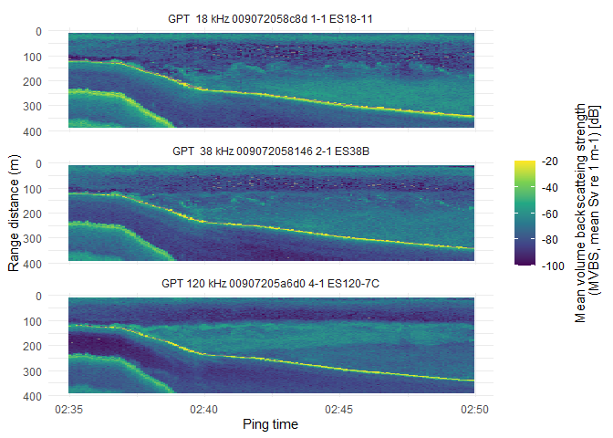

Plotting MVBS in R
================
Erin LaBrecque
2025-04-05

We will use `tidync` to read in and plot netCDF data exported from
[Echopype](https://github.com/OSOceanAcoustics/echopype).

`tidync` was developed and maintained by
[ROpenSci](https://github.com/ropensci/tidync/tree/main)

# Install…

from CRAN:

``` r
#install.packages("tidync")
```

or the developmental install from GitHub:

``` r
# install.packages("remotes")
#remotes::install_github("ropensci/tidync", dependencies = TRUE)
```

# Attach packages

``` r
library(tidync)
library(dplyr)
library(ggplot2)
library(lubridate)
```

# Load the data

The .nc file is in the data folder. First set a path to the data folder
using the `here` package, then load the file using `tidync`.

``` r
# path to data folder
dta <- here::here("data")
```

We are only going to use one function from the `here` package, so we are
not going to attach it to our session like we did by calling the other
packages with `library()`. By using the package name and `::` we can
call a function from the package (assuming it is in your library
folder). We are using `here()` instead of `setwd()` because `here()`
enables easy file referencing by using the your top-level directory
(folder) to build file paths. Use `paste0()` to concatenate the file
path and file name.

paste0(dta, “/test_MVBS.nc”) -\> “path to your folder/data/test_MVBS.nc”

``` r
# load data - retrieve both values in the data array and the metadata with tidync()
mvbs <- tidync(paste0(dta, "/test_MVBS.nc"))
```

# Examine the data structure

``` r
# show data
mvbs
```

    ## 
    ## Data Source (1): test_MVBS.nc ...
    ## 
    ## Grids (4) <dimension family> : <associated variables> 
    ## 
    ## [1]   D2,D1,D0 : Sv    **ACTIVE GRID** ( 419580  values per variable)
    ## [2]   D0       : channel, frequency_nominal
    ## [3]   D1       : ping_time, latitude, longitude
    ## [4]   D2       : depth
    ## 
    ## Dimensions 3 (all active): 
    ##   
    ##   dim   name      length   min   max start count  dmin  dmax unlim coord_dim 
    ##   <chr> <chr>      <dbl> <dbl> <dbl> <int> <int> <dbl> <dbl> <lgl> <lgl>     
    ## 1 D0    channel        3    NA    NA     1     3    NA    NA FALSE TRUE      
    ## 2 D1    ping_time    180     0   895     1   180     0   895 FALSE TRUE      
    ## 3 D2    depth        777     0   388     1   777     0   388 FALSE TRUE

Under dimensions, `unlim == FALSE` means that the extent of the data are
fixed. `coord_dim == TRUE` means that the dimension being used is
attached o the dataset. In larger datasets, you might not want to bring
in all the data.

Use `hyper_dims()` to inspect the dimensions in more detail.

``` r
hyper_dims(mvbs)
```

    ## # A tibble: 3 × 7
    ##   name      length start count    id unlim coord_dim
    ##   <chr>      <dbl> <int> <int> <int> <lgl> <lgl>    
    ## 1 depth        777     1   777     2 FALSE TRUE     
    ## 2 ping_time    180     1   180     1 FALSE TRUE     
    ## 3 channel        3     1     3     0 FALSE TRUE

<br>

Use `hyper_vars()` to explore the variable - Sv.

``` r
hyper_vars(mvbs)
```

    ## # A tibble: 1 × 6
    ##      id name  type      ndims natts dim_coord
    ##   <int> <chr> <chr>     <int> <int> <lgl>    
    ## 1     0 Sv    NC_DOUBLE     3     7 FALSE

# Examine the data values

To access the data values, you have to active the correct grid with
`activate()`, then extract the values with `hyper_tibble()`.

Use `glimpse()` to view the data types and the first few values.

``` r
ping_data <- mvbs %>% 
  activate(Sv) %>% 
  hyper_tibble()

glimpse(ping_data)
```

    ## Rows: 409,320
    ## Columns: 4
    ## $ Sv        <dbl> -4.291311, -39.067087, -45.867860, -61.991222, -70.152770, -…
    ## $ depth     <chr> "9.5", "10", "10.5", "11", "11.5", "12", "12.5", "13", "13.5…
    ## $ ping_time <chr> "2017-07-26T02:35:00", "2017-07-26T02:35:00", "2017-07-26T02…
    ## $ channel   <chr> "GPT  18 kHz 009072058c8d 1-1 ES18-11", "GPT  18 kHz 0090720…

<br>

Sv is stored as double, but depth and ping_time are stored as
characters. These need to be changed to double and datetime
respectively.

``` r
ping_data <- ping_data %>%  
  mutate(depth = as.numeric(depth),
         ping_time = ymd_hms(ping_time))

glimpse(ping_data)
```

    ## Rows: 409,320
    ## Columns: 4
    ## $ Sv        <dbl> -4.291311, -39.067087, -45.867860, -61.991222, -70.152770, -…
    ## $ depth     <dbl> 9.5, 10.0, 10.5, 11.0, 11.5, 12.0, 12.5, 13.0, 13.5, 14.0, 1…
    ## $ ping_time <dttm> 2017-07-26 02:35:00, 2017-07-26 02:35:00, 2017-07-26 02:35:…
    ## $ channel   <chr> "GPT  18 kHz 009072058c8d 1-1 ES18-11", "GPT  18 kHz 0090720…

<br>

# Plot

``` r
ping_data %>% 
  ggplot(aes(ping_time, depth, color = Sv)) +
  geom_tile() +
  scale_y_reverse() +
  scale_color_viridis_c(limits = c(-100, -20)) +
  facet_wrap(~channel, nrow = 3) +
  theme_minimal() +
  theme(legend.title = element_text(angle = 90, hjust = 0.5),
        legend.title.position = "right") +
  labs(x = "Ping time",
       y = "Range distance (m)",
       color = "Mean volume backscatteing strength
       (MVBS, mean Sv re 1 m-1) [dB]")
```

<!-- -->
